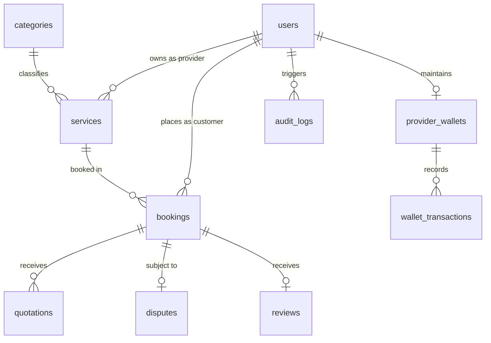

# 🏠 HomeServe (ZUP Service Marketplace)
### Enterprise On-Demand Home Services & Smart Technician Dispatching Platform

<div align="center">

[](https://github.com/NguyenLee15/ZUP_Service-Marketplace)
[](https://nestjs.com/)
[](https://nextjs.org/)
[](https://expo.dev/)
[](https://www.postgresql.org/)
[](https://redis.io/)
[](https://deepmind.google/technologies/gemini/)
[](https://vnpay.vn/)

<p align="center">
  <b>A production-grade, full-stack marketplace connecting homeowners with verified technicians.</b><br/>
  Engineered with <b>Modular Monolith Clean Architecture</b>, real-time WebSocket bidding, atomic financial transactions, and AI-driven dispute resolution.
</p>

</div>

---

## 📑 Table of Contents
- [1. Executive Summary & Business Context](#1-executive-summary--business-context)
- [2. Multi-Client Ecosystem & Portals](#2-multi-client-ecosystem--portals)
- [3. System Architecture & Tech Stack](#3-system-architecture--tech-stack)
- [4. Core Business Workflows & Engineering Deep-Dives](#4-core-business-workflows--engineering-deep-dives)
  - [4.1 Booking Lifecycle State Machine](#41-booking-lifecycle-state-machine)
  - [4.2 Provider Deposit Wallet & VNPay Idempotency](#42-provider-deposit-wallet--vnpay-idempotency)
  - [4.3 AI Semantic Search & Dispute Mediation](#43-ai-semantic-search--dispute-mediation)
  - [4.4 Staff RBAC & Security Route Matrix](#44-staff-rbac--security-route-matrix)
- [5. Database Schema & Data Integrity](#5-database-schema--data-integrity)
- [6. Project Structure](#6-project-structure)
- [7. Quick Start & Local Installation](#7-quick-start--local-installation)
- [8. Deployment Architecture (Render & Vercel)](#8-deployment-architecture-render--vercel)
- [9. Testing & Quality Assurance](#9-testing--quality-assurance)

---

## 1. Executive Summary & Business Context

In the fragmented on-demand home service industry (electrical repairs, plumbing, HVAC maintenance, appliance servicing), customers face persistent trust barriers: **uncertain pricing, unverified technician quality, and lack of warranty mediation**. Conversely, freelance technicians struggle with **unstable job leads, delayed commissions, and payment disputes**.

**HomeServe** resolves these structural industry bottlenecks through an end-to-end digital platform:
1. **Transparent 2-Tier Pricing**: Preliminary price ranges guide customer expectations, followed by on-site surveyor inspection and formal quotation before work begins.
2. **Provider Financial Integrity**: Prepaid deposit escrow wallet system with automated commission snapshotting, preventing debt default while guaranteeing technician payout.
3. **AI Dispute Resolution**: Integrated Google Gemini multimodal assistant analyzing work evidence attachments, chat history, and contracts to provide objective adjudication recommendations.
4. **Guaranteed 24-Hour Acceptance**: Automatic job closure and commission ledger reconciliation after 24 hours of technician completion if uncontested.

---

## 2. Multi-Client Ecosystem & Portals

The platform is designed around 3 decoupled, role-specific client applications:

```
┌─────────────────────────────────────────────────────────────────────────────────┐
│                           HOMESERVE PLATFORM ECOSYSTEM                          │
├────────────────────────┬───────────────────────────────┬────────────────────────┤
│   1. Customer Web      │      2. Provider Mobile       │    3. Admin Portal     │
│   (Next.js 16.2 App)   │     (Expo SDK 54 / RN 0.81)   │   (Next.js 16.2 App)   │
├────────────────────────┼───────────────────────────────┼────────────────────────┤
│ • Semantic AI Search   │ • Real-time Job Dispatch      │ • Real-time Analytics  │
│ • Catalog & Filtering  │ • On-site Survey & Quoting    │ • Booking Oversight    │
│ • Booking Management   │ • GPS Navigation              │ • KYC Verification     │
│ • In-app Live Chat     │ • Deposit Wallet & VNPay      │ • AI Dispute Resolver  │
│ • Review & Disputes    │ • Real-time Customer Chat     │ • Staff RBAC & Audits  │
└────────────────────────┴───────────────────────────────┴────────────────────────┘
```

---

## 3. System Architecture & Tech Stack

### High-Level Architecture Diagram

```
┌─────────────────────────────────────────────────────────────────────────────┐
│                             CLIENT LAYER                                    │
│   Next.js 16 Web (BFF Proxy)           Expo SDK 54 Mobile (Provider App)    │
└───────────────────────┬───────────────────────────────┬─────────────────────┘
                        │ HTTP / REST                   │ WebSockets (Direct)
                        ▼                               ▼
┌─────────────────────────────────────────────────────────────────────────────┐
│                          BACKEND APPLICATION LAYER                          │
│                          NestJS Monolith Framework                          │
│                                                                             │
│  [ Auth / RBAC ]  [ Bookings Engine ]  [ Provider Wallets ]  [ Chats / WS ] │
│  [ Services / AI] [ Disputes Engine ]  [ Audit Logging    ]  [ Notification]│
│                                                                             │
│  • Event-Driven Decoupling: EventEmitter2 (BookingService -> Notifications) │
│  • Concurrency Guard: Prisma $transaction for atomic ledger & state changes │
│  • Security Filter: JwtAuthGuard, RolesGuard, PermissionsGuard, Throttler   │
└───────────────────────┬───────────────────────────────┬─────────────────────┘
                        │                               │
        ┌───────────────┴───────────────┐               ▼
        ▼                               ▼         [ External Services ]
┌──────────────────────────────┐ ┌──────────────┐ • VNPay (HMAC-SHA512)
│      PostgreSQL 16 Engine    │ │ Redis 7.2    │ • Google Gemini AI
│ • Relational Business Ledger │ │ • BullMQ     │ • Cloudinary (Media)
│ • pgvector 768d Embeddings   │ │ • Throttling │ • Brevo (Transactional Mail)
│ • Full-Text Search Indexes   │ │ • Pub/Sub    │
└──────────────────────────────┘ └──────────────┘
```

### Technology Matrix

| Layer | Technology | Purpose |
| :--- | :--- | :--- |
| **Backend Core** | NestJS 11, TypeScript | Modular monolith backend framework |
| **Database & ORM** | PostgreSQL 16, Prisma ORM | Relational data persistence with strict foreign keys |
| **Vector Engine** | pgvector (768-dimensional) | Semantic AI vector search for service recommendations |
| **Background Queues** | Redis 7.2, BullMQ | Asynchronous email jobs, notification dispatch, cron workers |
| **Artificial Intelligence** | Google Gemini 2.5 Flash | Intent classification, dispute reasoning, embeddings |
| **Payment Gateway** | VNPay (HMAC-SHA512) | Real-time wallet top-up with idempotent IPN verification |
| **Frontend Web** | Next.js 16.2, React 19, Tailwind | Customer Web Portal & Staff Admin Dashboard (App Router) |
| **Mobile App** | Expo SDK 54, React Native 0.81 | Cross-platform Android/iOS technician field application |
| **UI Components** | Shadcn UI, Radix Primitives | Accessible, customizable design system |
| **State Management** | Zustand | Client-side reactive store for session and cart state |

---

## 4. Core Business Workflows & Engineering Deep-Dives

### 4.1 Booking Lifecycle State Machine

The booking lifecycle is governed by a strict, non-skippable finite state machine ensuring contractual compliance between Customer, Provider, and Platform:

```
  [ Customer ]                [ Provider ]               [ Customer / System ]
       │                           │                               │
   POST /bookings                  │                               │
       ▼                           │                               │
   (PENDING) ────────────► POST /quotations                        │
                                   ▼                               │
                               (QUOTED) ──────────────► PATCH /confirm
                                   │                               ▼
                                   │                          (CONFIRMED)
                                   │                               │
                                   │◄─────────── PATCH /start ─────┘
                                   ▼
                             (IN_PROGRESS)
                                   │
                                   ▼
                             PATCH /done
                                   │
                                   ▼
                                (DONE) ───[ auto_completed_at = +24h ]───┐
                                   │                                     │
                 Customer Confirms │                                     ▼ (Timer Expiry)
                                   └──────────────────────────────► [ COMPLETE ]
                                                                   (Commission Deducted)
                                   ┌─────────────────────────────────────┘
                 Customer Disputes │
                                   ▼
                              (DISPUTED) ───► Admin Adjudication: COMPLETE or PENALIZE
```

- **Cancellation Rule**: Allowed strictly at `PENDING` and `QUOTED` stages.
- **Snapshot Commission Rate**: Commission rate is locked at quotation generation (`quotations.commission_rate_snapshot`) to prevent billing disputes upon policy changes.
- **Auto-Acceptance Window**: Technicians submit completion evidence; customers have a 24-hour window to inspect before the system auto-completes and transfers escrowed funds.

---

### 4.2 Provider Deposit Wallet & VNPay Idempotency

Technicians maintain a prepaid deposit wallet (`provider_wallets`). If the balance drops below zero, the wallet is flagged as `is_restricted = true`, disabling job acceptance until topped up.

```
Provider App                 Backend API                     VNPay Gateway
    │                             │                                │
    ├──── POST /deposit/create ──►│                                │
    │    (Amount: 500k)           ├─ Gen Idempotency UUID          │
    │                             ├─ Insert PENDING Transaction    │
    │                             ├─ Create HMAC-SHA512 Checksum ─►│
    │◄─── Return VNPay URL ───────┤                                │
    │                             │                                │
    ├────────────────────── Redirect to Payment Portal ───────────►│
    │                             │                                │
    │                             │◄── IPN Webhook (Server-to-Server)
    │                             │    • Verify SHA512 Signature   │
    │                             │    • Check duplicate TxnRef    │
    │                             │    • prisma.$transaction:      │
    │                             │      UPDATE status = SUCCESS   │
    │                             │      balance += amount         │
    │                             │      is_restricted = false     │
    │                             │─── HTTP 200 {RspCode: '00'} ──►│
```

- **Zero Race Conditions**: Balance updates and status transitions execute within an atomic `prisma.$transaction`.
- **IPN Idempotency**: Duplicate webhook payloads with matching `vnpay_txn_ref` and `SUCCESS` status are safely ignored without double-crediting.

---

### 4.3 AI Semantic Search & Dispute Mediation

HomeServe utilizes **Google Gemini 2.5 Flash** and **text-embedding-004** for domain-specific automation:
- **Natural Language Discovery**: Converts colloquial customer queries (*"máy lạnh chảy nước phòng khách"*) into 768-dimensional embeddings, performing cosine distance similarity queries against `pgvector` indexes with sub-second latency.
- **AI Dispute Assistant**: When a dispute is filed, the assistant analyzes the booking timeline, quote breakdown, on-site survey images, and message logs, synthesizing an unbiased incident report with a recommended adjudication (`COMPLETE` or `PENALIZE`).

---

### 4.4 Staff RBAC & Security Route Matrix

The backend enforces defense-in-depth security with multi-layer authorization guards:

| Role | Access Scope | Enforcement Layer |
| :--- | :--- | :--- |
| **`CUSTOMER`** | Personal bookings, quotation confirmations, reviews, disputes | `@Roles(Role.CUSTOMER)` + Tenant ID ownership check |
| **`PROVIDER`** | Assigned bookings, quotation submissions, wallet management | `@Roles(Role.PROVIDER)` + KYC Approved Guard |
| **`STAFF`** | Operational duties based on granular assigned permissions | `@Roles(Role.STAFF)` + `@RequirePermissions(...)` |
| **`ADMIN`** | Unrestricted management, financial oversight, staff creation | `@Roles(Role.ADMIN)` |

- **Anti-IDOR (Insecure Direct Object Reference)**: Every write and read operation on addresses, bookings, and chats explicitly validates the authenticated JWT user against record ownership.
- **Brute-Force Mitigation**: Throttling enabled on `/auth/login` (5 req/min), `/auth/verify-otp` (10 req/min), and `/auth/refresh` (20 req/min).

---

## 5. Database Schema & Data Integrity

The database is built on PostgreSQL with strict constraints, foreign keys, and enumerated domain types:



### Database Highlights:
- **`users`**: Multi-role accounts (`CUSTOMER`, `PROVIDER`, `STAFF`, `ADMIN`) with status flags (`ACTIVE`, `LOCKED`, `PENDING`).
- **`provider_wallets`**: Real-time balance ledger with `is_restricted` enforcement.
- **`audit_logs`**: Tamper-evident logging of all balance adjustments, status changes, and administrative interventions.
- **`pgvector`**: Native vector column on services for AI similarity matching.

---

## 6. Project Structure

The repository is organized as a clean, decoupled monorepo:

```
service-marketplace/
├── Be/                                # NestJS Monolithic Backend
│   ├── prisma/
│   │   ├── schema.prisma              # Data models, enums & vector definitions
│   │   └── migrations/                # Database migration history
│   ├── src/
│   │   ├── common/                    # Guards, interceptors, filters, decorators
│   │   ├── config/                    # Environment schema & validation
│   │   ├── modules/                   # Domain modules (auth, bookings, wallets...)
│   │   │   ├── admin/                 # Management dashboards & moderation
│   │   │   ├── bookings/              # 6-stage lifecycle engine
│   │   │   ├── provider-wallets/      # Ledger, VNPay HMAC-SHA512 gateway
│   │   │   ├── disputes/              # AI-assisted dispute resolution
│   │   │   └── services/              # Service listings & pgvector semantic search
│   │   └── main.ts                    # NestJS bootstrap with global validation
│   └── test/                          # Unit, integration & e2e test suites
│
├── fe/
│   ├── web/                           # Next.js 16.2 App Router Web Platform
│   │   ├── app/
│   │   │   ├── (main)/                # Customer Portal (Home, Catalog, Bookings)
│   │   │   ├── (admin)/               # Staff & Admin Management Portal
│   │   │   ├── (auth)/                # Multi-role authentication flows
│   │   │   └── api/                   # BFF (Backend-For-Frontend) proxy layer
│   │   ├── components/                # Reusable UI components (Shadcn + Radix)
│   │   ├── features/                  # Domain-driven state hooks & services
│   │   └── types/                     # Shared TypeScript contracts
│   │
│   └── mobile/                        # Expo SDK 54 / React Native Provider App
│       ├── app/                       # Expo Router file-based screens
│       ├── components/                # Mobile-optimized UI widgets
│       └── services/                  # Direct API & WebSocket connectors
│
├── render.yaml                        # Render Backend & PostgreSQL IaaC manifest
├── vercel.json                        # Vercel Frontend Web deployment configuration
├── docker-compose.yml                 # Local multi-container development environment
└── .gitignore                         # Production-clean Git ignore configuration
```

---

## 7. Quick Start & Local Installation

### Prerequisites
- **Node.js**: `v20.x` or `v22.x` (LTS)
- **Docker & Docker Compose**: For local PostgreSQL + Redis setup
- **Git**

### 1. Clone the Repository
```bash
git clone https://github.com/NguyenLee15/ZUP_Service-Marketplace.git
cd ZUP_Service-Marketplace
```

### 2. Launch Local Database & Redis (Docker)
```bash
docker compose up -d postgres redis
```

### 3. Setup Backend (`Be`)
```bash
cd Be
npm install

# Setup environment variables
cp .env.example .env

# Generate Prisma client & apply migrations
npx prisma generate
npx prisma migrate dev

# (Optional) Seed demo users & sample services
npm run seed:demo-safe

# Start backend in development mode
npm run start:dev
```
Backend API will be accessible at: `http://localhost:3001` (Swagger docs at `/api/docs`).

### 4. Setup Frontend Web (`fe/web`)
```bash
cd ../fe/web
npm install

# Setup environment variables
cp .env.example .env.local

# Start Next.js development server
npm run dev
```
Web platform will be accessible at: `http://localhost:3000`.

### 5. Setup Provider Mobile App (`fe/mobile`)
```bash
cd ../mobile
npm install

# Launch Expo development server
npx expo start
```
Scan the QR code using the **Expo Go** app on your Android or iOS device.

---

## 8. Deployment Architecture (Render & Vercel)

The system is configured for continuous zero-downtime deployment:

- **Backend & Database (Render)**:
  - Deployed via [render.yaml](file:///d:/DATN/service-marketplace/render.yaml) targeting `rootDir: Be`.
  - Automated build script: `npm ci --include=dev && npx prisma generate && npx prisma migrate deploy && npm run build`.
  - Managed PostgreSQL with pgvector extension enabled.
- **Frontend Web Portal (Vercel)**:
  - Deployed via [vercel.json](file:///d:/DATN/service-marketplace/vercel.json) with Next.js App Router optimization.
  - Serverless BFF API proxy routes directing traffic securely to the Render backend URL.
- **Dual Remote Sync**:
  - Code pushes to `origin` automatically synchronize to **GitLab** (Render/Vercel CI/CD triggers) and **GitHub** (Portfolio showcase).

---

## 9. Testing & Quality Assurance

The codebase enforces strict testing before every production build:

```bash
# Backend Verification
cd Be
npm run typecheck         # Zero TypeScript errors check
npm run test              # Unit tests
npm run test:e2e          # End-to-end integration tests

# Frontend Verification
cd ../fe/web
npx tsc --noEmit          # Next.js strict typecheck
npm run build             # Production bundle build test
```

---

## 👨‍💻 Author & Contact

**Lê Văn Nguyên (NguyenLee15)**  
- **Role**: Full-Stack Software Engineer
- **Email**: [nguyen2004hd@gmail.com](mailto:nguyen2004hd@gmail.com)
- **GitHub**: [@NguyenLee15](https://github.com/NguyenLee15)
- **Portfolio**: [https://github.com/NguyenLee15](https://github.com/NguyenLee15)

---
<div align="center">
  <i>Developed with ❤️ for Academic & Software Engineering Excellence.</i>
</div>
