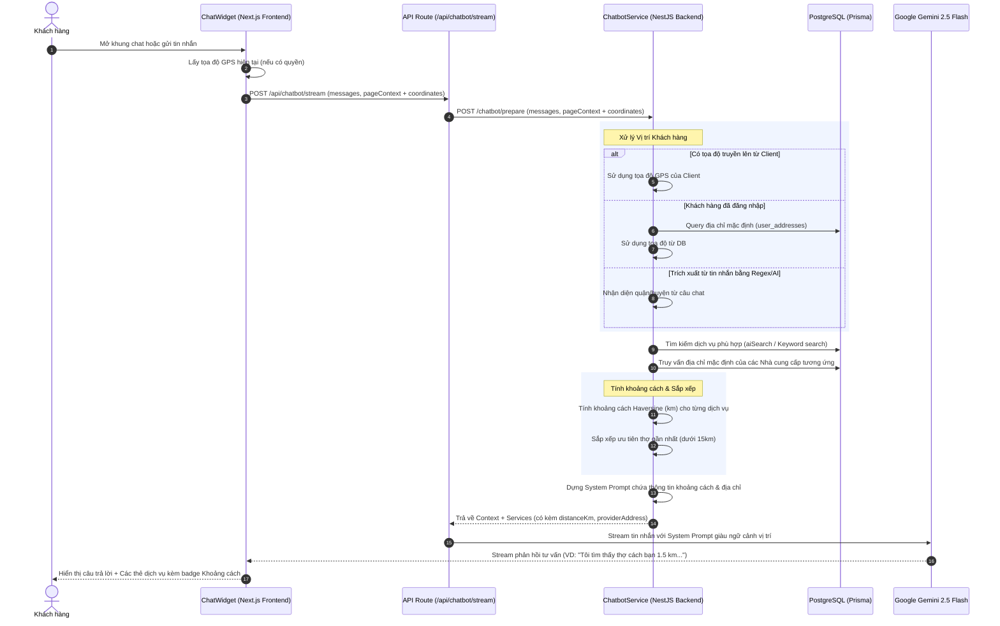

# Thiết kế: Chatbot Nhận Biết Vị Trí & Gợi Ý Thợ Gần Nhất (Location-Aware Chatbot)

Tài liệu này mô tả thiết kế kỹ thuật chi tiết để tích hợp tính năng nhận biết vị trí địa lý của Khách hàng và Nhà cung cấp (Thợ) vào Customer AI Assistant, giúp đưa ra các đề xuất tối ưu về mặt địa lý, tăng tính thực tế và nâng cao trải nghiệm người dùng.

---

## 1. Tổng quan & Mục tiêu

Hiện tại, chatbot của HomeServe chỉ tìm kiếm dịch vụ dựa trên mức độ tương đồng ngữ nghĩa (semantic search) hoặc từ khóa thuần túy mà không xem xét khoảng cách địa lý. Điều này dẫn đến việc gợi ý những thợ ở quá xa khách hàng, không khả thi trong thực tế.

**Mục tiêu:**
- **Tính toán khoảng cách thực tế:** Đo khoảng cách đường chim bay (Haversine formula) giữa vị trí Khách hàng và Thợ.
- **Tích hợp vị trí đa nguồn:** 
  1. *Profile Address:* Lấy từ địa chỉ mặc định của Khách hàng đã đăng nhập.
  2. *Browser Geolocation:* Lấy tọa độ GPS thời gian thực thông qua Browser API (nếu được cho phép).
  3. *Natural Language Processing:* Tự động nhận diện quận/huyện từ tin nhắn chat (Ví dụ: "ở quận 7", "khu vực Bình Thạnh").
- **Tư vấn thông minh bằng AI:** Đưa thông tin khoảng cách và địa chỉ vào ngữ cảnh hệ thống (System Prompt) để Gemini 2.5 Flash tư vấn tự nhiên.
- **Premium UI/UX:** Hiển thị tag khoảng cách bắt mắt trên các thẻ dịch vụ đề xuất trong khung chat.

---

## 2. Thiết kế Luồng Dữ Liệu (Data Flow)



---

## 3. Chi Tiết Kỹ Thuật (Technical Details)

### 3.1 Thuật toán tính khoảng cách (Haversine Formula)

Sử dụng công thức Haversine để tính khoảng cách giữa hai tọa độ địa lý $(lat_1, lng_1)$ và $(lat_2, lng_2)$ trên Backend:

```typescript
export function calculateHaversineDistance(
  lat1: number,
  lon1: number,
  lat2: number,
  lon2: number,
): number {
  const R = 6371; // Bán kính Trái Đất (km)
  const dLat = ((lat2 - lat1) * Math.PI) / 180;
  const dLon = ((lon2 - lon1) * Math.PI) / 180;
  
  const a =
    Math.sin(dLat / 2) * Math.sin(dLat / 2) +
    Math.cos((lat1 * Math.PI) / 180) *
      Math.cos((lat2 * Math.PI) / 180) *
      Math.sin(dLon / 2) *
      Math.sin(dLon / 2);
      
  const c = 2 * Math.atan2(Math.sqrt(a), Math.sqrt(1 - a));
  return R * c; // Khoảng cách (km)
}
```

### 3.2 Tinh chỉnh Prompt AI & Cung cấp ngữ cảnh
Chúng ta sẽ định dạng lại danh sách dịch vụ gửi vào System Prompt cho Gemini như sau:

```typescript
private buildServiceContext(services: ServiceWithRelations[], customerCoords?: { lat: number; lng: number }) {
  return services
    .map((service) => {
      const distanceText = service.distanceKm 
        ? `${service.distanceKm.toFixed(1)} km` 
        : 'chưa xác định';
        
      return `- [ID:${service.id}] ${service.name} 
        | Giá tham khảo: ${this.formatPrice(Number(service.referencePrice))} 
        | Nhà cung cấp: ${service.provider.fullName}
        | Địa chỉ: ${service.providerAddress || 'chưa rõ'}
        | Khoảng cách đến bạn: ${distanceText}
        | Đánh giá: ${Number(service.avgRating || 0).toFixed(1)}/5 (${service.totalReviews} đánh giá)
        | Mô tả: ${service.description}`;
    })
    .join('\n');
}
```

### 3.3 Trích xuất địa chỉ tự nhiên bằng Regex (Fallback)
Nhận diện nhanh các quận/huyện phổ biến tại TP.HCM/Hà Nội từ tin nhắn khách hàng để lọc nhanh:
```typescript
private extractDistrictFromText(text: string): string | null {
  const normalized = this.normalize(text);
  const match = normalized.match(/(quan|q\.)\s*([0-9a-zA-Z\s]+)/i);
  if (match) {
    return `Quận ${match[2].trim()}`;
  }
  return null;
}
```

---

## 4. Giao Diện Người Dùng (UI/UX)

### 4.1 Bổ sung Nút Yêu Cầu Vị Trí (Quick Reply)
Khi phát hiện khách hàng đang tìm kiếm dịch vụ nhưng hệ thống chưa có tọa độ GPS/địa chỉ, chatbot sẽ chủ động hiển thị Quick Reply:
- `📍 Chia sẻ vị trí GPS` (Gọi Geolocation API)
- `🏠 Dùng địa chỉ mặc định` (Đối với User đã đăng nhập)

### 4.2 Thẻ Dịch Vụ Nâng Cao (Premium Design)
Thêm badge khoảng cách nhỏ gọn, tinh tế bên cạnh giá tiền hoặc tên nhà cung cấp bằng Vanilla CSS & Tailwind:
- Icon `MapPin` màu xanh dương dịu.
- Khoảng cách được làm tròn 1 chữ số thập phân (VD: `1.2 km`, `3.5 km`).
- Trực quan hóa mức độ gần: dưới 3km hiển thị text màu xanh lá (Rất gần), từ 3-8km màu xanh dương, trên 8km màu xám.

---

## 5. Kịch Bản Kiểm Thử & Xác Minh (Verification Plan)

### 5.1 Kiểm thử đơn vị (Unit Test)
- Kiểm tra tính chính xác của hàm tính Haversine.
- Kiểm tra độ nhạy của bộ Regex bóc tách quận/huyện từ tin nhắn.

### 5.2 Kiểm thử tích hợp (E2E)
1. **Trường hợp đã đăng nhập:** Đảm bảo hệ thống lấy đúng địa chỉ mặc định của tài khoản và tính khoảng cách chính xác tới địa chỉ của Thợ.
2. **Trường hợp Guest cho phép GPS:** Đảm bảo lấy đúng tọa độ từ Geolocation API, truyền qua API route và trả về khoảng cách chính xác.
3. **Trường hợp từ chối GPS:** Đảm bảo chatbot fallback mượt mà sang hỏi địa chỉ bằng văn bản hoặc cho phép tự nhập.
